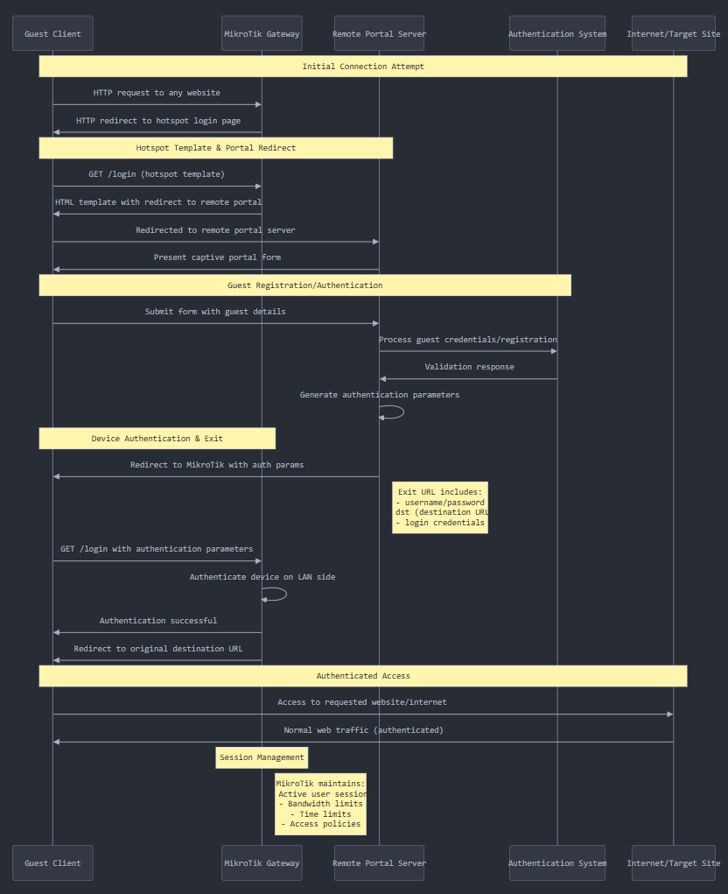

What does this script do?
===

The reconfig.py script configures multiple MikroTik devices to work with the SnapX captive portal system.

It automatically sets up internet hotspot login pages on multiple devices by reading their connection details from a preconfigured CSV file.

Step-by-step process:

Reads configuration - Gets RADIUS server settings from the config file
Connects to each device - Uses SSH to access each device listed in a CSV file
Gets current access rules - Checks what IP addresses are currently allowed to connect via SSH
Downloads login pages - Fetches customized login page templates from a web server
Configures the hotspot - Sets up each device to:
- Use the new login pages for public WiFi access
- Allow access to specific websites (like AWS and SelectNetworx)
- Use RADIUS authentication to verify user logins
- Update SSH access permissions for remote management

Issues
===

The biggest issue we've seen in the field is that devices may have `require message authentication` enabled for the radius setup.  This needs to be turned off.  Currently affects devices on RouterOS > v7.15.